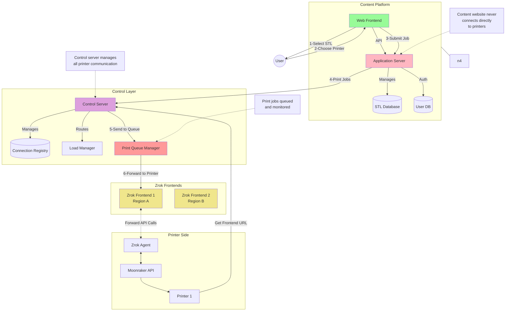
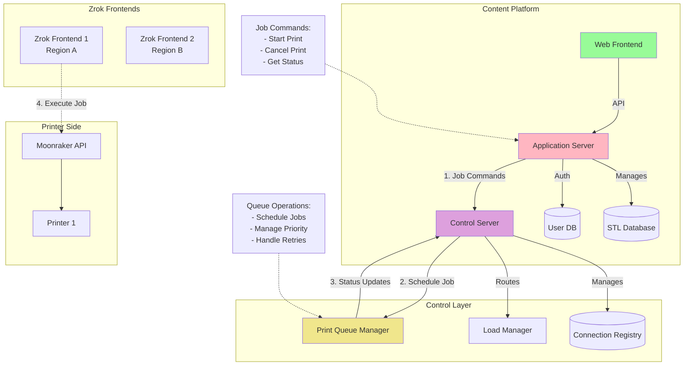

# 3D Printer Fleet Management Architecture

## Overview
This document outlines the architecture for managing thousands of distributed 3D printers using Zrok as the proxy solution for Moonraker API access. The design focuses on scalability, reliability, and simplicity of implementation.

## System Components

### 1. Local Environment (Printer Side)
- 3D Printer running Klipper
- Moonraker API (port 7125)
- Zrok Agent for secure tunneling

### 2. Control Layer
- Central Control Server
- Connection Registry Database
- Load Manager
- Metrics Tracker

### 3. Infrastructure
- Multiple standalone Zrok Frontends
- Geographic distribution for better latency
- Independent operation for fault isolation

## Printer communication Diagram

## System communication Diagram

## Clarified Print Job Flow

## Key Design Decisions

### 1. Use of Zrok
- Chosen for its lightweight and reliable tunneling capabilities
- Simple deployment and maintenance
- No modifications needed to Moonraker API
- Secure by default with TLS

### 2. Distributed Frontend Approach
- Multiple standalone Zrok instances instead of clustering
- Each frontend operates independently
- Simpler than implementing load balancing at Zrok level
- Better fault isolation

### 3. Smart Routing via Control Server
- Central control server manages printer-to-frontend assignments
- Assignments based on:
  - Geographic proximity
  - Current frontend load
  - System health metrics
  - Network conditions

## Implementation Requirements

### 1. Control Server
- RESTful API for printer registration
- Frontend health monitoring
- Connection tracking
- Load balancing algorithm
- Metrics collection and analysis

### 2. Zrok Frontend
- Minimum Requirements per Instance:
  - 1-2 CPU cores
  - 1-2 GB RAM
  - 10GB storage
  - Standard network connection
- Scales to approximately 100-200 printers per instance

### 3. Printer Agent
- Zrok agent installation
- Initial registration with control server
- Automatic reconnection logic
- Health reporting

## Security Considerations

1. All connections secured via TLS
2. Token-based authentication
3. Isolated printer connections
4. Access control at control server level

## Scaling Strategy

1. Start with minimal deployment:
   - Single frontend
   - Basic control server
   - Monitor resource usage

2. Scale horizontally by:
   - Adding Zrok frontends in new regions
   - Enhancing control server logic
   - Implementing more sophisticated routing

3. Monitor and optimize:
   - Track connection metrics
   - Analyze geographic distribution
   - Adjust routing algorithms

## Next Steps

1. Implementation Priority:
   - Set up control server infrastructure
   - Deploy first Zrok frontend
   - Develop printer registration process
   - Implement basic routing logic

2. Testing:
   - Connection reliability
   - Failover scenarios
   - Load testing
   - Geographic distribution effectiveness